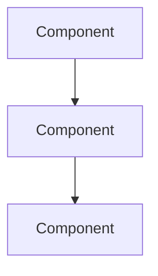

# Engineering Design Doc — Template Reference

Read this file after the doc type is determined to be **Engineering Design Doc (design-doc)**.
It contains the mapping rules, writing rules, self-review checklist, and document template for this type.

## Table of Contents
1. [Mapping Rules](#mapping-rules) — Step 2: Map & Augment
2. [Writing Rules](#writing-rules) — Step 3: Generate Document
3. [Self-Review Checklist](#self-review-checklist) — Step 3: Generate Document
4. [Document Template](#document-template) — Step 3: Generate Document

---

## Mapping Rules

Map outline content to document sections:

| Outline Content | → Document Section |
|---|---|
| Overview | **TL;DR** (condense to 2-3 sentences) + **Context & Motivation** (expand with problem statement) |
| Section Key Thoughts (per topic) | **Proposed Design** subsections — group related topics under Overview, Detailed Design, Data Model |
| Implementation Approaches with Pros/Cons | **Alternatives Considered** — format as decision table |
| Open Questions (all sections) | **Open Questions** — deduplicated and prioritized |
| Prerequisites | **Context & Motivation** — weave into constraints narrative |
| Suggested Visualizations | **Mermaid diagrams** — generate inline in relevant sections |
| Sources & References | **References** — carry forward all links |
| Abandoned / Deferred Topics | **Alternatives Considered** — mention as ruled-out options with reasoning |
| *Gap-fill needed* | **Goals**, **Non-Goals**, **Cross-Cutting Concerns**, **Migration/Rollout**, **Risks & Mitigations** |

---

## Writing Rules

- **Tone:** Technical, thorough, but not dry. Write for a senior engineer who needs to understand and approve.
- **Detailed Design** gets the most depth — this is where API contracts, data models, algorithms, and key implementation details live. Use code blocks for schemas and interfaces.
- **Must include at least 1 Mermaid diagram** (system overview at minimum).
- **Cross-Cutting Concerns** should address: security, privacy, observability (metrics/logging/alerting), performance, and scalability. Only include sections relevant to the project.
- **Migration/Rollout** should describe phased deployment, feature flags, rollback plan, and data migration strategy if applicable.

---

## Self-Review Checklist

Run this checklist internally before writing the file. Auto-fix any failures.

- [ ] TL;DR is 2-3 sentences max
- [ ] Non-Goals section is present and non-empty
- [ ] Alternatives Considered has 2+ options with a decision table
- [ ] At least 1 Mermaid diagram is included
- [ ] Open Questions are listed
- [ ] All outline sources appear in References
- [ ] Length is 3-10 pages (roughly 1500-5000 words)

---

## Document Template

Use this structure for the generated document:

---

# [Title]

**Author:** [name] | **Date:** [date] | **Status:** Draft
**Reviewers:** [names]

## TL;DR

[2-3 sentence summary: what you're building, why, and the key approach]

## Context & Motivation

[Why this work is needed. What problem exists today. What triggered this effort.
Include relevant background a reviewer needs to understand the proposal.
Reference existing systems, metrics, or incidents that motivate the change.]

## Goals

- [Measurable goal 1]
- [Measurable goal 2]

## Non-Goals

- [Explicitly out of scope item 1 — and why]
- [Explicitly out of scope item 2 — and why]

## Proposed Design

### System Overview

[High-level architecture description]

### Detailed Design

[API contracts, key interfaces, algorithms, control flow.
Use code blocks for schemas and signatures.
Be specific enough that another engineer could implement from this.]

### Data Model

[New tables, schema changes, migrations.
Show the actual schema, not just a description.]

## Alternatives Considered

| Criteria | Option A (Chosen) | Option B | Option C |
|---|---|---|---|
| [Criterion] | [Assessment] | [Assessment] | [Assessment] |
| **Verdict** | **Selected** | Rejected: [reason] | Rejected: [reason] |

[Detailed discussion of why each alternative was considered and rejected]

## Cross-Cutting Concerns

- **Security:** [authentication, authorization, data protection]
- **Privacy:** [PII handling, data retention, compliance]
- **Observability:** [metrics, logging, alerting, dashboards]
- **Performance:** [expected load, latency targets, benchmarks]

## Migration / Rollout Plan

[Phased deployment strategy, feature flags, rollback plan, data migration steps]

## Risks & Mitigations

| Risk | Likelihood | Impact | Mitigation |
|---|---|---|---|
| [Risk] | Low/Med/High | Low/Med/High | [Mitigation strategy] |

## Open Questions

- [ ] [Unresolved question 1]
- [ ] [Unresolved question 2]

## References

- [Source title](link)
- Code: `path/to/relevant/code`
